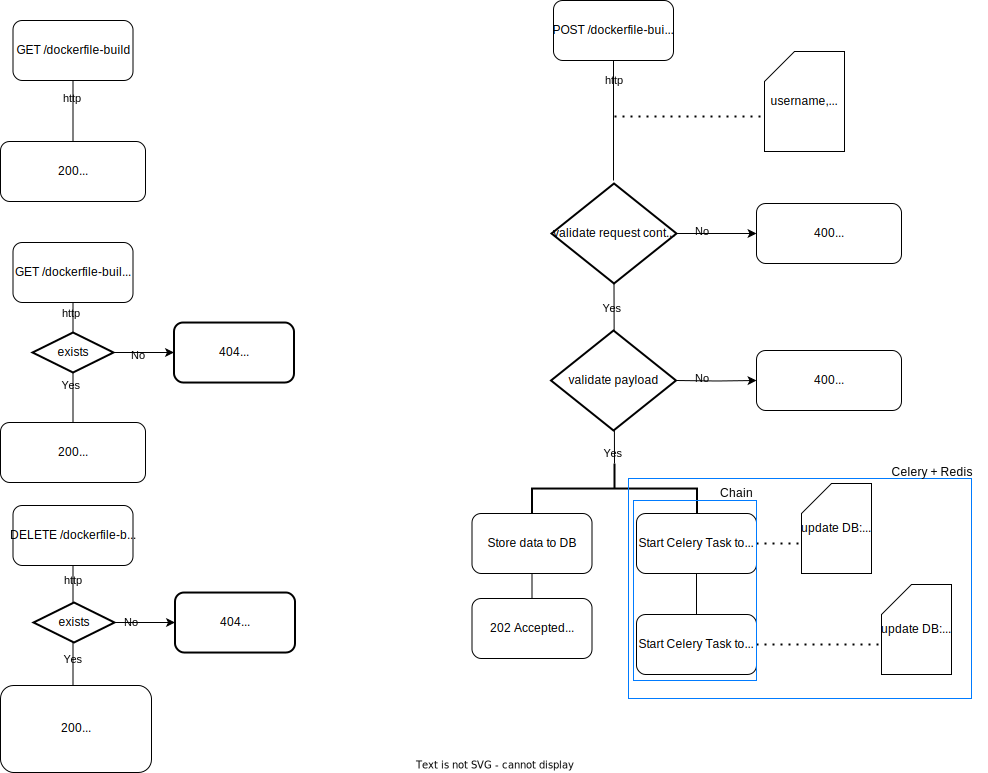

# Dockerfile publisher

It is RESTful service that accepts a Dockerfile from the user. The service builds a Docker image out of the Dockerfile and pushes it to a Docker registry. 

For the purpose of this assignment, it can be assumed that the service and Docker daemon run on the same machine.


## Tech Stack

**Technologies:**
- *Django* (4.2.7) web framework provides the foundational structure for RESTful service.
- *Django Rest Framework* is on top of Django to simplify the creation of RESTful APIs.
- *Docker SDK* allows you to interact with the Docker daemon
- *Celery* is a worker processes that run tasks independently from one another and outside the context of your main service. Configured in ```celety.py``` and ```settings.py```
- *Redis* a message broker 


## Installation

**Pre-requirments**:
- python
- redis
- docker 

#### Docker configuration:
- Login on to your docker hub  ```docker login``` , in case you would like local docker deamon
OR
- Add 'password' or 'docker_password' to POST request 

#### Steps to RUN the project

1. Create and activate virtual environment. Install ```requirements.txt``` .
    ``` bash
    python -m venv venv
    source ./venv/bin/activate
    pip install -r requirements.txt
    ```

2. Run RESTful service.

    2.0. Make migrations.
    ``` bash
        cd dockerfile_publisher
        python manage.py makemigrations
        python manage.py migrate     
    ```

    2.1. Run Django server
    ``` bash
        cd dockerfile_publisher
        python manage.py runserver
    ```
    2.2. Run celery worker in another Terminal to process asynchronous tasks 
    ``` bash
    cd dockerfile_publisher
    source ./venv/bin/activate
    celery -A dockerfile_publisher.celery worker -l info  
    ```
    2.3. Make sure Redis is running.
    ``` bash
    redis-server
    ```


## Architecture
#### UML


#### HTTP Requests


There are 4 HTTP requests:

1. Main functionlity of buildinf image and pushing is under POST ```api/dockerfile-build``` request. Payload must have ```username``` and ```file```
    ```bash 
    curl -X POST \
    http://127.0.0.1:8000/api/dockerfile-build/ \
    -H 'Content-Type: multipart/form-data' \
    -F 'username=your_username' \
    -F 'file=@path/to/your/Dockerfile'

    ```

2. There are 2 GET requests:

    2.1 ```GET api/dockerfile-build/``` to get list of dockerfile builds.

    2.2 ```GET /api/dockerfile-build/?dockerfile_build_id=:id```` to get specific dockerfile build details. Useful to check Status.

3. ```DELETE /dockerfile-build/?dockerfile_build_id=:id``` to delete Dockerfile from server, to delete 'buiild details' from database and to delete Docker Image.


## Features
- Dockerfile build prcess has statuses: ```"Build is starting"```, ```"Image successfully built. To be publishesd"``` and ```"Docker Image is successfully pushed to Docker Hub"```.
- Store Dockerfile
- Build Docker Image from Dockerfile
- Publish Docker Image to Docker Hub
- Get list of dockerfile builds (process) with current status
- Get dockerfile build by process id.
- Clean up: Delete Dockerfile from local storage, from database and from the Docker daemon host machine deamon


## Running Tests

To run tests, run the following command

1. Run Celery worker.

```bash
    cd dockerfile_publisher
    celery -A dockerfile_publisher.celery worker -l info    
```
2. Run tests.

```bash
    cd dockerfile_publisher 
    python manage.py test restapi/    
```
## Optimizations

TODO:
- containerize for easier installation on different machines
- optimize ```POST /dockerfile-build``` test to be isolated from Docker Hub
- add tests for ```DELETE /dockerfile-build?<id>```
- ...
## References
- [Django doc](https://docs.djangoproject.com/en/4.2/intro/tutorial01/): Django's official documentation.
- [Django Rest Framework doc](https://www.django-rest-framework.org/#installation): Documentation for Django Rest Framework.
- [Docker SDK](https://docker-py.readthedocs.io/en/stable/images.html): Documentation for Docker SDK in Python.
- [Celery](https://docs.celeryq.dev/en/stable/getting-started/first-steps-with-celery.html): Documentation for Celery, a task queue.
- [Redis message broker](https://redis.io/docs/install/install-redis/): Documentation for installing Redis, a message broker.
- [Celery+Redis](https://realpython.com/asynchronous-tasks-with-django-and-celery/): Tutorial on using Celery with Redis for asynchronous tasks.